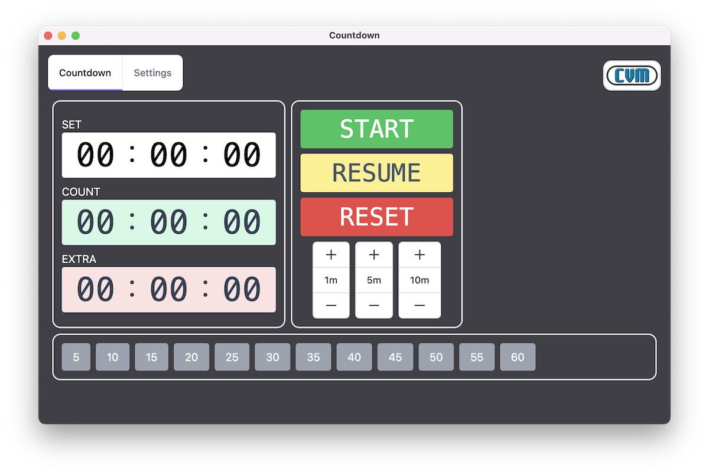
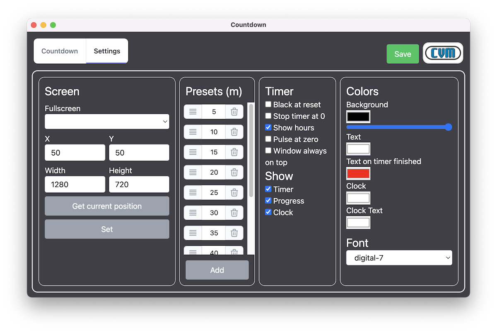
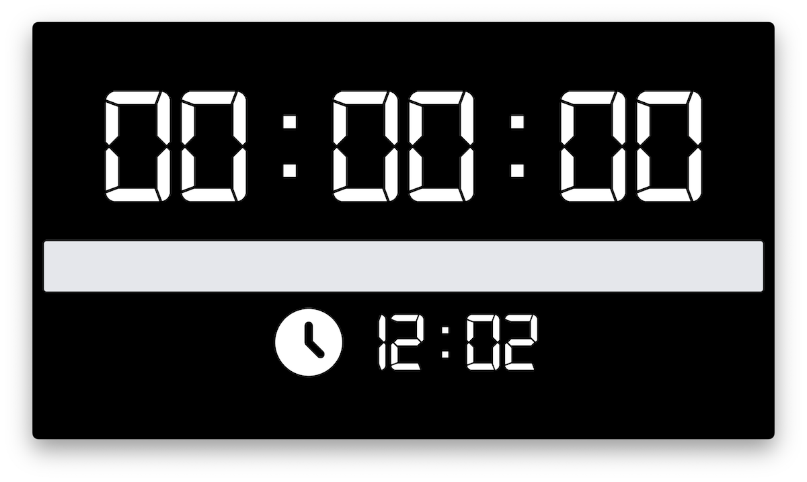

# Countdown

Simple countdown for live events

<a href="https://bitfocus.io/companion/?ref=wiki" target="_new"></a>

_Companion module in beta version (compatible with v0.0.15 and later)_

### Download

You can download latest release from [releases](https://github.com/CVMEventi/Countdown/releases)

### APIs

- [HTTP APIs](https://github.com/CVMEventi/Countdown/wiki/HTTP-APIs)
- OSC (Soon)

### Images
Main window to set timer


Settings window


Countdown going


Countdown stopped


#### Build Setup

``` bash
# install dependencies
npm install

# serve app with hot reload
npm start

# build electron application for production
npm run make
```
